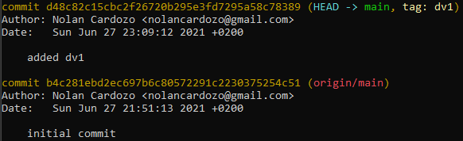
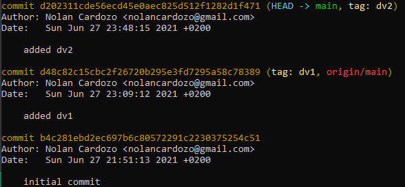

# DVC and MLflow


# DVC

This repository requires git, dvc and mlflow to be installed.

You can install dvc and mlflow with the following commands:

```
pip install dvc
pip install mlflow
```

The local project contained the following files at first. 


To start using dvc, we need to initialise the repository with git and dvc as follows:

```
git init
dvc init
```
the commands creates a folder '.git/', '.dvc/' folders that contain all the information needed by either of them to function. 

Let us focus on the '.dvc/' folder. There are several files created under '.dvc/'. The config file is empty at first but this file is of particular interest as we will see further in this tutorial.


We can then go ahead and make out first commit.

```
git commit -m "initial commit"
```

We can then create a remote repository on github called 'dvc_mlflow' and run the following commands to push the changes to github.

```
git remote add origin https://github.com/nolancardozo13/dvc_mlflow.git
git branch -M main
git push -u origin main
```

Now we will download an image dataset from kaggle (https://www.kaggle.com/c/aptos2019-blindness-detection) using the 'download_and_extract.py' script.

Note: Please make sure the kaggle access token is available in the kaggle.json file in the working directory. This file includes your login details to authenticate with kaggle. 

```
python3 download_and_extract --out_path <out_path optional>
```

This downloads and extracts the  dataset under a folder 'datasets' unless specified otherwise using the --out_path argument.

 Note: The download takes a while because the image dataset is large.

 After the download is complete you will see all the times under the 'dataset' folder in the working directory.

 To work with dvc we need to add a 'remote' location where the datasets will be ultimately stored. This remote can be on premise on your company servers, cloud storage like S3 or your local system. For this tutorial, we will add a local remote itself. To add a remote we run the following:

 ```
 dvc remote add -d "data_store" "/tmp/data"
 ``` 
 The above command creates a remote with name "data_store" with the path "/tmp/data" which is folder under /tmp on my local ubuntu system. The -d option is for 'default' remote. On a successful run, dev will print "Setting 'data_store' as a default remote."

This command also adds the remote location to the '.dvc/config' file. To view this you can run:

```
cat .dvc/config
```

 Now we can add the dataset to the staging area of dvc by running the command:

 ```
dvc add dataset
 ```

Note: This will take long for the first time because the dataset is large. For subsequent runs, dvc will only add the changes so it should be quicker.

After the successful run, dvc creates 2 files:

1) dataset.dvc : This includes the Hashed location of the dataset, its size and number of files. You can view this by running 'cat dataset.dvc'

2) .gitignore : A gitignore file that will ignore the dataset directly adding to staging area. You can modify this file to ignore other files and folders that are not necessary to commit.

These 2 files now need to be added to git and then git will have all the information to link to the dvc data_store. To add to git we run:

```
git add dataset.dvc .gitignore
```

Now we can commit the changes. Use a suitable message to identify the dataset. Here I use "dv1" as an alias for "data version 1"

```
git commit -m "added dv1"
```

A good practice is to add a tag for a dataset, so that it can be referred to by this tag. To do this run:

```
git tag -a "dv1" -m "the original dataset"
```

To view all the commits run ```git log```. The output is shown below:



This shows the commit and its associated tag 'dv1'.

We can push the changes to dvc and git.

```
dvc push
git push 
```

Now we can delete dataset from our local folder since it is tracked by dvc. 
Note: Do not remove the dataset.dvc file as this file contains the link between git and dvc 

```
rm -rf dataset
```

Incase we want to use the dataset again, we can always download it from the dvc remote by running:

```
dvc pull
```
This downloads the dataset again in the current working directory.

Now, we will split the dataset into train and validation sets and create a new csv annotations file to include the ground truth for both the training and validation sets. To do this we will run the following python script:

```
python3 split_data.py 
```

Now that we have 2 sub-folders (traind and val from train), we can store this new version of the dataset to the dvc remote. To do this we repeat the previously used procedure.

```
dvc add dataset
git add dataset.dvc
git commit -m "added dv2"
git tag -a "dv2" -m "the split dataset"
```

Now you can run ```git log``` to check the difference versions of the dataset in git along with their tags.



Once verified, we can now push the changes to dvc remote and guthub:

```
dvc push
git push 
```

# MLflow

Now we will use a particular version of our dataset to train the model and track training parameters, metrics, artifacts and models using MLflow.

All we need to do is point the trining script to the location that the dataset is stored. To do this, we include the following code in the training script:

```
import dvc
data_url = dvc.api.get_url(
        path = <path in repo>,
        repo = <repo>,
        rev = <version>
    )
```

We can pass this ```data_url``` to the custom dataset class in pytorch and the integration is complete. Please look at the "train.py" file to get a clear idea about how the integration is done.

In this example, we use a docker environment to build and run the MLflow project. To build the docker container run the following:

```
docker build -t dvc_mlflow .
```

Now that the docker image is built, you can start training the model by running the following command:

```
mlflow run . -P data_version="dv2" -P data_path="dataset" -A  gpus=all
```

The paramters are passed after the -P option. To see all the parameters that the command takes, please view the 'MLproject.yaml' manifest file. The arguments to the docker run can be specified with a -A option. In this case we specify "gpus = all" to run the training all all available gpus.

When the mlflow tracking starts, a folder names 'mlruns' will be created which logs all the metrics, parameters and artifacts on the local system. You can also log to remote server or cloud by setting up a tracking server on AWS or on premise at your company.


