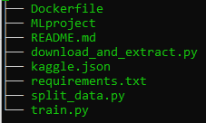

# DVC and MLflow


# Steps

This repository requires git, dvc and mlflow to be installed.

You can install dvc and mlflow with the following commands:

```
pip install dvc
pip install mlflow
```

The local project contained the following files at first. 



To start using dvc, we need to initialise the repository with git and dvc as follows:

```
git init
dvc init
```
the commands creates a folder '.git/', '.dvc/' folders that contain all the information needed by either of them to function. 

Let us focus on the '.dvc/' folder. There are several files created under '.dvc/'. The config file is empty at first but this file is of particular interest as we will see further in this tutorial.


We can then go ahead and make out first commit.

```
git commit -m "initial commit"
```

We can then create a remote repository on github called 'dvc_mlflow' and run the following commands to push the changes to github.

```
git remote add origin https://github.com/nolancardozo13/dvc_mlflow.git
git branch -M main
git push -u origin main
```

Now we will download an image dataset from kaggle (https://www.kaggle.com/c/aptos2019-blindness-detection) using the 'download_and_extract.py' script.

Note: Please make sure the kaggle access token is available in the kaggle.json file in the working directory. This file includes your login details to authenticate with kaggle. 

```
python3 download_and_extract --out_path <out_path optional>
```

This downloads and extracts the  dataset under a folder 'datasets' unless specified otherwise using the --out_path argument.

 Note: The download takes a while because the image dataset is large.

 After the download is complete you will see all the times under the 'dataset' folder in the working directory.

 To work with dvc we need to add a 'remote' location where the datasets will be ultimately stored. This remote can be on premise on your company servers, cloud storage like S3 or your local system. For this tutorial, we will add a local remote itself. To add a remote we run the following:

 ```
 dvc remote add -d "data_store" "/tmp/data"
 ``` 
 The above command creates a remote with name "data_store" with the path "/tmp/data" which is folder under /tmp on my local ubuntu system. The -d option is for 'default' remote.

This command adds the remote to the '.dvc/config' file 

 Now we can add the dataset to the staging area running the command:

 ```
dvc add dataset
 ```

 This 


